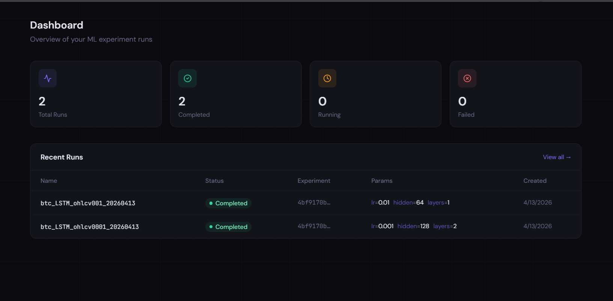
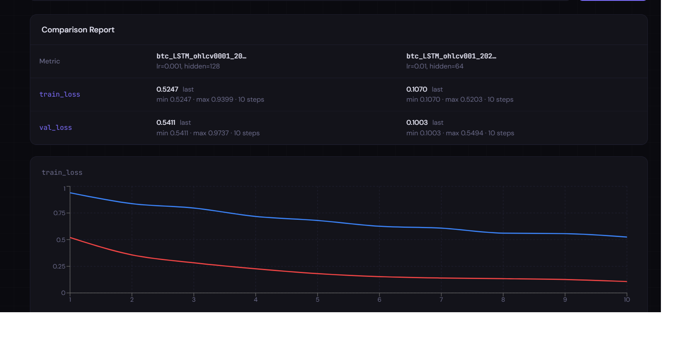
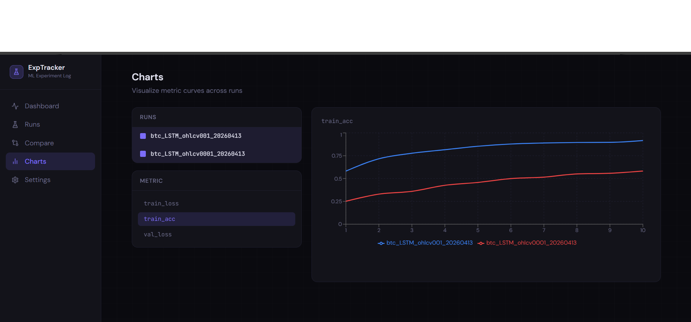

<div align="center">

#  Experiment Tracking System

**Ứng dụng web theo dõi, quản lý và so sánh các thí nghiệm Machine Learning/ Deep Learning một cách trực quan**

</div>

---

## ⚡ Tổng quan dự án

**Experiment Tracking System** là một ứng dụng web giúp các kỹ sư và nhà nghiên cứu ML/AI **theo dõi, quản lý và so sánh** các thí nghiệm machine learning một cách có hệ thống — thay thế hoàn toàn việc ghi chép thủ công bằng Excel hay ghi chú rời rạc.

> Người dùng chỉ cần đăng nhập, tạo experiment, log kết quả từng run, và ngay lập tức thấy được biểu đồ so sánh trực quan giữa các lần thử nghiệm.

So sánh với các công cụ hiện tại như **MLflow** hay **Weights & Biases**, chúng tôi tập trung vào:

1. **Giao diện đơn giản, không cần cấu hình phức tạp** — chạy được ngay trên máy cá nhân (localhost)
2. **Dashboard trực quan** — biểu đồ line chart, bar chart so sánh metrics giữa các run
3. **Cộng tác nhóm** — phân quyền Viewer / Editor / Admin, chia sẻ kết quả trong team
4. **Phù hợp sinh viên** — không yêu cầu kiến thức hạ tầng cloud hay DevOps

---

## 🖥️ Demo giao diện

> *(Cập nhật ảnh chụp màn hình sau khi hoàn thành MVP)*

| Dashboard | So sánh Runs | Quản lý Experiment |
|:---------:|:------------:|:-----------------:|
|  |  |  |

---

## 🏗️ Kiến trúc hệ thống

```
┌─────────────────────────────────────────────────────────┐
│                     Người dùng                          │
└────────────────────────┬────────────────────────────────┘
                         │ HTTP / HTTPS
┌────────────────────────▼────────────────────────────────┐
│              Frontend — React + Tailwind CSS            │
│   Dashboard │ Charts (Recharts) │ Table (TanStack)      │
└────────────────────────┬────────────────────────────────┘
                         │ REST API (JSON)
┌────────────────────────▼────────────────────────────────┐
│               Backend — Python FastAPI                  │
│   Auth (JWT) │ Experiment API │ Run API │ Metric API    │
└──────────┬──────────────────────────────────┬───────────┘
           │                                  │
┌──────────▼──────────┐           ┌───────────▼───────────┐
│     PostgreSQL       │           │    File Storage       │
│  (Metadata & Logs)  │           │   (Model Artifacts)   │
└─────────────────────┘           └───────────────────────┘
```

### Stack công nghệ

| Tầng | Công nghệ | Mục đích |
|------|-----------|----------|
| **Frontend** | React 18, Tailwind CSS | Giao diện người dùng |
| **Biểu đồ** | Recharts | Line chart, Bar chart, Scatter plot |
| **Bảng dữ liệu** | TanStack Table | Filter, sort danh sách runs |
| **Backend** | Python 3.10+, FastAPI | REST API server |
| **ORM** | SQLAlchemy | Tương tác database |
| **Database** | PostgreSQL | Lưu trữ dữ liệu |
| **Auth** | JWT (JSON Web Token) | Xác thực người dùng |
| **File Storage** | Local filesystem | Lưu artifact (MVP) |

---

## 📁 Cấu trúc thư mục

```
experiment-tracking-system/
├── frontend/                        # React application
│   ├── src/
│   │   ├── components/              # Các component tái sử dụng
│   │   │   ├── charts/              # Line chart, Bar chart, Scatter plot
│   │   │   ├── tables/              # Bảng danh sách runs có filter/sort
│   │   │   └── ui/                  # Button, Input, Modal, ...
│   │   ├── pages/                   # Các trang chính
│   │   │   ├── LoginPage.jsx        # Trang đăng nhập / đăng ký
│   │   │   ├── DashboardPage.jsx    # Trang tổng quan
│   │   │   ├── ExperimentsPage.jsx  # Danh sách experiments
│   │   │   ├── RunsPage.jsx         # Danh sách runs của 1 experiment
│   │   │   └── CompareRunsPage.jsx  # So sánh nhiều runs
│   │   ├── services/                # Gọi API
│   │   ├── store/                   # State management
│   │   └── App.jsx
│   ├── package.json
│   └── ...
│
├── backend/                         # FastAPI application
│   ├── app/
│   │   ├── api/                     # Route handlers
│   │   │   ├── auth.py              # Đăng ký, đăng nhập, JWT
│   │   │   ├── experiments.py       # CRUD experiment
│   │   │   ├── runs.py              # CRUD run
│   │   │   ├── metrics.py           # Log & lấy metrics
│   │   │   └── artifacts.py         # Upload & download artifacts
│   │   ├── models/                  # SQLAlchemy models
│   │   │   ├── user.py
│   │   │   ├── experiment.py
│   │   │   ├── run.py
│   │   │   ├── metric.py
│   │   │   └── artifact.py
│   │   ├── schemas/                 # Pydantic schemas (request/response)
│   │   ├── core/                    # Config, security, database
│   │   │   ├── config.py
│   │   │   ├── security.py          # JWT helper
│   │   │   └── database.py          # DB engine & session
│   │   └── main.py                  # FastAPI app entry point
│   ├── tests/                       # pytest test files
│   ├── requirements.txt
│   └── .env.example
│
├── docs/                            # Tài liệu & ảnh chụp màn hình
│   └── images/
├── .gitignore
├── docker-compose.yml               # Khởi động toàn bộ hệ thống
├── README.md
└── LICENSE
```

---

## 🚀 Hướng dẫn cài đặt

### Yêu cầu hệ thống

- **OS**: Windows, Linux, macOS
- **Python**: 3.10+
- **Node.js**: 18+
- **PostgreSQL**: 14+

### Cách 1 — Docker (khuyến nghị)

```bash
# 1. Clone repository
git clone https://github.com/your-org/experiment-tracking-system.git
cd experiment-tracking-system

# 2. Tạo file cấu hình môi trường
cp backend/.env.example backend/.env
# Chỉnh sửa .env nếu cần (mặc định đã chạy được)

# 3. Khởi động toàn bộ hệ thống
docker compose up -d

# 4. Truy cập ứng dụng
# Frontend:  http://localhost:3000
# API docs:  http://localhost:8000/docs
```

### Cách 2 — Chạy thủ công (Local)

#### Backend

```bash
cd backend

# Tạo môi trường ảo
python -m venv venv
source venv/bin/activate          # Linux/macOS
# hoặc: venv\Scripts\activate     # Windows

# Cài đặt dependencies
pip install -r requirements.txt

# Cấu hình môi trường
cp .env.example .env
# Chỉnh sửa .env với thông tin database của bạn

# Khởi động server
uvicorn app.main:app --reload --port 8000
```

#### Frontend

```bash
cd frontend

# Cài đặt dependencies
npm install

# Khởi động dev server
npm run dev
# Truy cập: http://localhost:3000
```

---

## ⚙️ Cấu hình

Tạo file `backend/.env` từ `.env.example` và điền các giá trị:

```env
# =================== DATABASE ===================
DB_HOST=localhost
DB_PORT=5432
DB_USER=postgres
DB_PASSWORD=your_password
DB_NAME=experiment_tracker

# =================== SECURITY ===================
SECRET_KEY=your-secret-key-here   # Dùng: openssl rand -hex 32
ACCESS_TOKEN_EXPIRE_MINUTES=1440  # 24 giờ

# =================== STORAGE ===================
ARTIFACT_STORAGE_PATH=./storage/artifacts
MAX_ARTIFACT_SIZE_MB=100
```

---

## 📊 Tính năng chính

### MVP (v1.0 — 12/04/2026)

- [x] Đăng ký / Đăng nhập bằng email + mật khẩu (JWT)
- [x] Tạo, sửa, xóa Experiment
- [x] Tạo Run, log Hyperparameters & Metrics
- [x] Xem danh sách Run theo Experiment (filter, sort)
- [x] **Line chart** so sánh accuracy/loss theo epoch giữa nhiều runs
- [x] **Bar chart** so sánh best metric giữa các runs
- [x] Phân quyền: Viewer / Editor

### Beta (v2.0 — 10/05/2026)

- [ ] Upload & quản lý Artifact (file model, hình ảnh)
- [ ] Mời thành viên vào nhóm qua email
- [ ] Export báo cáo CSV
- [ ] Scatter plot (learning_rate vs accuracy)

---

## 🤝 Đóng góp

Mọi đóng góp đều được hoan nghênh! Để đóng góp:

1. Fork repository này
2. Tạo branch mới: `git checkout -b feature/ten-tinh-nang`
3. Commit thay đổi: `git commit -m 'feat: thêm tính năng X'`
4. Push lên branch: `git push origin feature/ten-tinh-nang`
5. Tạo Pull Request

---

## 👥 Nhóm phát triển

| Thành viên | MSSV | Vai trò |
|------------|------|---------|
| `<họ tên>` | `<msv>` | Frontend |
| `<họ tên>` | `<msv>` | Frontend |
| `<họ tên>` | `<msv>` | Backend |
| `<họ tên>` | `<msv>` | Backend |

---

## 📄 Giấy phép

Dự án này sử dụng giấy phép [MIT](LICENSE).

---

<div align="center">

Made with ❤️ — Môn Phát triển Ứng dụng

</div>
