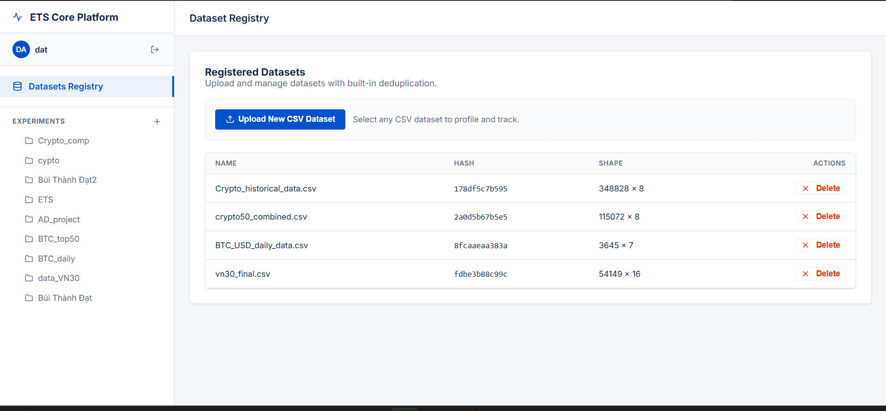
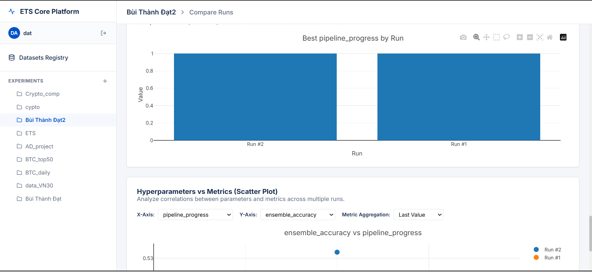
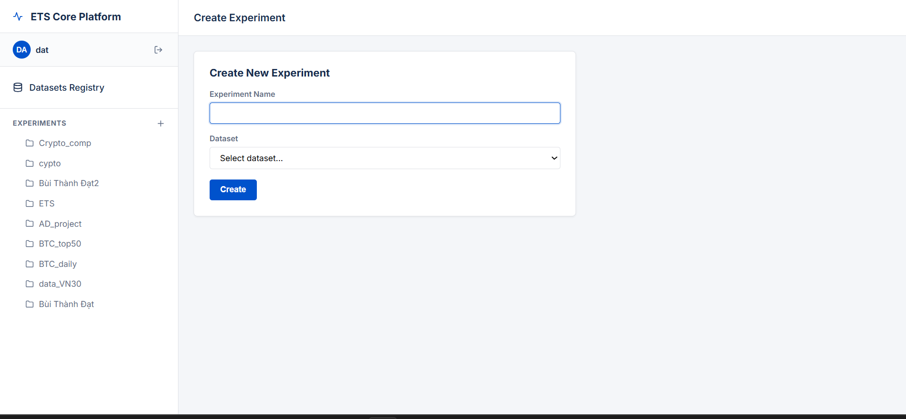

# ETS — Hệ Thống Theo Dõi Thí Nghiệm AI Cho Dự Báo Tài Chính

> Một nền tảng MLOps hiện đại dành cho dự báo tài chính, phân tích regime transfer và theo dõi thí nghiệm AI.

ETS (Experiment Tracking System) là một nền tảng web hỗ trợ quản lý và theo dõi quá trình huấn luyện mô hình AI trong lĩnh vực tài chính định lượng. Hệ thống cung cấp pipeline hoàn chỉnh cho việc quản lý dữ liệu, huấn luyện mô hình học máy, đánh giá bằng walk-forward validation, theo dõi kết quả thí nghiệm và trực quan hóa hiệu suất mô hình thông qua dashboard tương tác.

##  Tổng quan dự án

**Experiment Tracking System là một ứng dụng web cho phép người dùng tạo, lưu trữ và so sánh các thí nghiệm machine learning một cách có hệ thống. Thay vì ghi chép kết quả bằng Excel hay ghi chú rời rạc, người dùng có thể log hyperparameters và metrics của từng lần chạy, rồi xem lại qua dashboard với biểu đồ trực quan.
Lý do chọn đề tài: Trong quá trình học các môn Machine Learning, nhóm nhận thấy khi thử nghiệm nhiều bộ tham số khác nhau (learning rate, batch size, số epochs...), việc nhớ lại "lần chạy nào cho kết quả tốt nhất" rất khó nếu không ghi chép cẩn thận. Excel thì lộn xộn, ghi chú tay thì dễ mất — đây là vấn đề thực tế nhóm đã gặp.
Điểm khác so với phần mềm hiện có:
Các công cụ chuyên nghiệp như MLflow hay Weights & Biases rất mạnh nhưng đòi hỏi cấu hình phức tạp, cần hiểu về Docker, server, và thường tích hợp trực tiếp vào code Python. Dự án này hướng đến đối tượng là sinh viên hoặc người mới học ML với cách tiếp cận đơn giản hơn: người dùng tự nhập kết quả qua giao diện web, không cần cài đặt thêm bất cứ thứ gì, chạy được ngay trên localhost.

> Người dùng chỉ cần đăng nhập, tạo experiment, log kết quả từng run, và ngay lập tức thấy được biểu đồ so sánh trực quan giữa các lần thử nghiệm.

So sánh với các công cụ hiện tại như **MLflow** hay **Weights & Biases**, chúng tôi tập trung vào:

1. **Giao diện đơn giản, không cần cấu hình phức tạp** — chạy được ngay trên máy cá nhân (localhost)
2. **Dashboard trực quan** — biểu đồ line chart, bar chart so sánh metrics giữa các run
3. **Cộng tác nhóm** — phân quyền Viewer / Editor / Admin, chia sẻ kết quả trong team
4. **Phù hợp sinh viên** — không yêu cầu kiến thức hạ tầng cloud hay DevOps

---


---

# ✨ Tính Năng Chính

## 📊 Quản Lý Dữ Liệu
- Upload và quản lý dataset tài chính (CSV)
- Tự động tiền xử lý và trích xuất đặc trưng
- Lưu trữ dữ liệu có cấu trúc để đảm bảo khả năng tái lập thí nghiệm

## 🧪 Theo Dõi Thí Nghiệm
- Tạo các thí nghiệm độc lập theo từng dataset
- Theo dõi hyperparameters, metrics và kết quả mô hình
- So sánh nhiều lần chạy trực quan

## 🤖 Pipeline Machine Learning

Hỗ trợ nhiều phương pháp dự báo:

### Gradient Boosting Models
- LightGBM
- XGBoost
- Static LGB baseline
- Regime-aware transfer learning
- Ensemble forecasting pipelines

### Deep Learning Models
- LSTM
- Transformer cho chuỗi thời gian
- Tích hợp PyTorch

## 🔄 Walk-Forward Validation

Triển khai cơ chế backtesting theo expanding-window:
- Giảm data leakage
- Mô phỏng điều kiện dự báo thực tế
- Đánh giá độ ổn định của mô hình theo thời gian

## ⚙ Tùy Chỉnh Hyperparameter

Cho phép thay đổi trực tiếp từ giao diện:
- learning_rate
- max_depth
- boosting parameters
- custom experiment configs

## 📈 Trực Quan Hóa & Phân Tích

Dashboard Plotly tương tác:
- Biểu đồ so sánh kết quả
- Scatter analysis
- Xếp hạng metrics
- Phân tích tương quan giữa hyperparameter và hiệu suất

---

# 🖥 Demo Giao Diện

## Dashboard


---

## So Sánh Runs


---

## Quản Lý Experiment


---

# 🏗 Kiến Trúc Hệ Thống

```text
Frontend (React + Plotly)
        │
        ▼
 FastAPI REST API
        │
        ▼
 Experiment Tracking Layer
        │
 ┌──────┴────────┐
 ▼               ▼
ML Pipelines   SQLite Database
 ▼
Walk-Forward Engine
 ▼
Model Evaluation & Outputs
```

---

# 🧰 Công Nghệ Sử Dụng

## Backend
- Python 3.9+
- FastAPI
- SQLAlchemy
- Pydantic
- SQLite

## Machine Learning
- LightGBM
- XGBoost
- Scikit-learn
- PyTorch
- Pandas
- NumPy

## Frontend
- React.js
- Plotly.js
- Vanilla CSS

## Hạ Tầng
- Docker
- Docker Compose

---

# 📂 Cấu Trúc Dự Án

```text
project-proposal/
│
├── backend/
│   ├── db/
│   ├── ets/
│   ├── plugins/
│   └── vn_regime_transfer/
│
├── frontend/
│
├── docs/
│   ├── dashboard.png
│   ├── compare.png
│   └── experiments.png
│
├── outputs/
├── reports/
│
├── Dockerfile
├── docker-compose.yml
├── pyproject.toml
└── README.md
```

---

# 🚀 Hướng Dẫn Cài Đặt

## 1. Clone Repository

```bash
git clone https://github.com/JaydenB127/project-proposal.git
cd project-proposal
```

---

## 2. Tạo Virtual Environment

### Windows

```bash
python -m venv .venv
.venv\Scripts\activate
```

### Linux/macOS

```bash
python -m venv .venv
source .venv/bin/activate
```

---

## 3. Cài Đặt Thư Viện

```bash
pip install -r requirements.txt
```

Tùy chọn (cho Deep Learning):

```bash
pip install torch
```

---

## 4. Chạy Backend Server

### Windows PowerShell

```powershell
$env:PYTHONPATH="backend"
python -m ets.api.main
```

Server sẽ chạy tại:

```text
http://localhost:8000
```

---

## 5. Mở Giao Diện Web

Truy cập:

```text
http://localhost:8000
```

Bạn có thể:
- Upload dataset
- Tạo experiment
- Chạy pipeline
- So sánh kết quả dự báo
- Phân tích metrics trực quan

---

# 📊 Quy Trình Hoạt Động

```text
Upload Dataset
      ↓
Tạo Experiment
      ↓
Cấu Hình Hyperparameters
      ↓
Chạy Walk-Forward Validation
      ↓
Theo Dõi Metrics & Outputs
      ↓
Trực Quan Hóa Và So Sánh
```

---

# 🎯 Mục Tiêu Dự Án

Dự án hướng đến:
- Xây dựng nền tảng lightweight thay thế MLflow cho tài chính định lượng
- Hỗ trợ nghiên cứu AI có khả năng tái lập
- Quản lý vòng đời thí nghiệm machine learning
- Hạn chế data leakage trong time-series forecasting
- Cung cấp giao diện trực quan cho MLOps experimentation

---

# 🔬 Hướng Nghiên Cứu

Nền tảng được thiết kế cho:
- Dự báo chuỗi thời gian tài chính
- Regime transfer learning
- Quantitative research
- Walk-forward evaluation
- MLOps experimentation pipelines

---

# 👥 Nhóm Phát Triển

| Thành viên | MSSV | Vai trò |
|------------|------|----------|
| Bùi Thành Đạt | 23724811 | Trưởng nhóm |
| La Thiên Bảo | 23723801 | Thành viên |
| Lê Ngọc Huy | 23727381 | Thành viên |
| Bùi Huy Bảo | 23720161 | Thành viên |

---

# 📌 Phân Công Nhiệm Vụ

| Thành viên | Nhiệm vụ |
|------------|-----------|
| 23724811 – Bùi Thành Đạt | Backend: FastAPI routes, BackgroundTasks, WebSocket streaming |
| 23727381 – Lê Ngọc Huy | ML Pipeline: Data Ingestion, Feature Engineering, Regime Detection (HMM) |
| 23720161 – Bùi Huy Bảo | ML Pipeline: Walk-Forward Validation, Backtest, Statistical Tests, Reporting |
| 23723801 – La Thiên Bảo | Frontend: React SPA, UI/UX, Plotly charts, Dataset management |

---

# 📌 Hướng Phát Triển Tương Lai

- Hỗ trợ PostgreSQL
- Xác thực người dùng và phân quyền
- Huấn luyện bằng GPU
- Distributed experiment execution
- Tích hợp MLflow/W&B
- Streaming metrics realtime
- Model registry system
- Hỗ trợ cloud deployment

---

# 🧪 Kiểm Thử

Chạy end-to-end tests:

```bash
python test_e2e.py
```

hoặc

```bash
python test_deletion_e2e.py
```

---

## Đóng góp

Mọi đóng góp đều được hoan nghênh! Để đóng góp:

1. Fork repository này
2. Tạo branch mới: `git checkout -b feature/ten-tinh-nang`
3. Commit thay đổi: `git commit -m 'feat: thêm tính năng X'`
4. Push lên branch: `git push origin feature/ten-tinh-nang`
5. Tạo Pull Request

## Các câu hỏi cho thầy

1. Về phạm vi dự án:

Với thời gian còn lại đến 12/04, nếu nhóm không kịp làm hết các tính năng MVP thì ưu tiên tính năng nào trước?
Phần upload artifact (file model) có bắt buộc trong MVP không, hay chỉ cần lưu thông tin params và metrics là đủ?

2. Về kỹ thuật:

Hệ thống có cần deploy lên server thật (có domain, public URL) hay chỉ cần demo được trên localhost là đủ?
Backend và frontend có bắt buộc tách riêng (REST API) không, hay có thể dùng fullstack như Next.js cho đơn giản hơn?

3. Về chấm điểm:

Tiêu chí chấm phần visualization/dashboard được đánh giá như thế nào — chú trọng số lượng chart hay tính hữu ích của dữ liệu hiển thị?
Phần kiểm thử (testing) cần ở mức nào — unit test đầy đủ hay chỉ cần test thủ công và có ghi lại kết quả?

4. Về báo cáo Beta:

Phần "viết báo cáo" ở Beta Version cần theo mẫu cụ thể nào không, hay tự do trình bày?

</div>


# 📄 License

Dự án được phát hành theo giấy phép MIT License.

---

# 👨‍💻 Tác Giả

Phát triển như một nền tảng AI/MLOps phục vụ nghiên cứu dự báo tài chính và regime transfer modeling.
